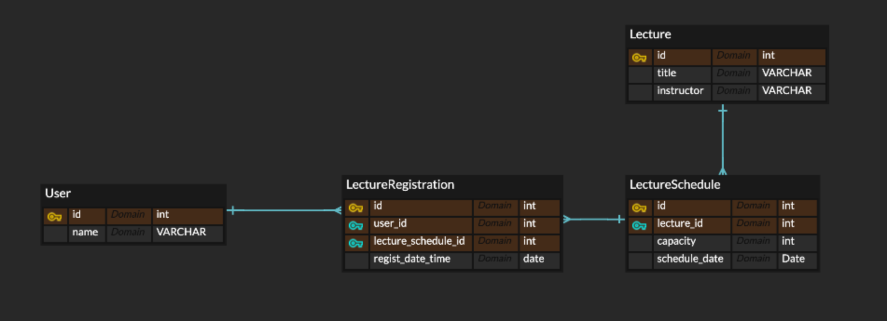

# 테이블 설계 보고서

## 설계한 ERD

### ERD 설명
-  User 테이블
   - 역할: 사용자 정보를 저장합니다.
   - 각 사용자는 유니크한 ID를 통해 특강 신청이나 조회 등을 할 수 있습니다.
   - 연관 관계: LectureRegistration 테이블과 1:N 관계를 가집니다. 즉, 한 명의 사용자가 여러 개의 강의를 신청할 수 있습니다.
- Lecture 테이블
  - 역할: 특강의 기본 정보를 저장합니다.
  - 강의와 관련된 핵심 정보(제목, 강사)를 관리하는 역할을 하며, 각 강의는 고유한 ID를 가집니다. 강의의 기본 정보와는 별도로 스케줄(날짜별 특강)과 수강인원을 관리할 필요가 있으므로 별도로 설계되었습니다.
  - 연관 관계: LectureSchedule 테이블과 1:N 관계를 가집니다. 하나의 강의가 여러 일정으로 제공될 수 있으며, 각 일정은 별도로 관리됩니다.
- LectureSchedule 테이블
  - 역할: 날짜별 특강 및 정원을 관리합니다.
  - 동일한 강의가 여러 날짜에 걸쳐 제공될 수 있으므로 각 날짜별로 강의를 관리하기 위해 별도의 테이블로 분리했습니다. 각 스케줄에 대한 정원을 별도로 관리하여, 강의 신청 시 선착순으로 정원을 넘지 않도록 처리합니다.
  - 연관 관계: 
    - Lecture 테이블과 N:1 관계를 가집니다. 여러 스케줄이 하나의 강의에 속할 수 있습니다.
    - LectureRegistration 테이블과 1:N 관계를 가집니다. 즉, 한 스케줄에 여러 명의 사용자가 신청할 수 있습니다.
- LectureRegistration 테이블
  - 역할: 사용자의 특강 신청 내역을 관리합니다.
  - 사용자가 강의 스케줄에 대한 신청을 관리하기 위해 설계되었습니다. 동일한 사용자가 동일한 스케줄(날짜별 특강)에 중복 신청하는 것을 막기 위해 user_id와 lecture_schedule_id의 조합을 유니크하게 가져갔습니다.

  - 연관 관계:
    - User 테이블과 N:1 관계를 가집니다. 한 명의 사용자가 여러 강의에 신청할 수 있지만, 각 신청은 하나의 사용자와 연결됩니다.
    - LectureSchedule 테이블과 N:1 관계를 가집니다. 여러 사용자가 하나의 스케줄에 신청할 수 있지만, 각 신청은 하나의 스케줄에만 연결됩니다.

### 설계 이유
- 강의와 스케줄의 분리:
  - 하나의 강의가 여러 날짜에 걸쳐 제공될 수 있기 때문에 Lecture 테이블과 LectureSchedule 테이블을 분리했습니다. 이를 통해 동일한 강의가 여러 일정으로 관리되면서도 각 일정별로 신청 상태를 별도로 관리할 수 있게 됩니다.
- 사용자와 신청 내역의 분리:
  - 각 사용자가 어떤 강의를 신청했는지 추적하기 위해 LectureRegistration 테이블을 별도로 두어 관리했습니다. User 테이블은 기본 사용자 정보만을 관리하고, 특강 신청에 대한 구체적인 정보는 LectureRegistration에서 관리함으로써 확장성과 관리 효율성을 높였습니다.
- 선착순 제한:
  - LectureSchedule 테이블에서 capacity 필드를 통해 강의 정원을 관리합니다. 기본적으로 정원은 30명으로 고정되어 있으며, 이를 통해 선착순 신청을 제한하고, 30명이 넘는 경우 신청을 거부하는 로직을 쉽게 구현할 수 있습니다.
- 중복 신청 방지:
  - LectureRegistration 테이블에서 user_id와 lecture_schedule_id의 조합을 유니크하게 유지함으로써 동일 사용자가 동일 강의에 중복 신청하는 것을 방지할 수 있도록 설계했습니다.
- 확장성:
  - 스케줄과 신청 내역이 분리되어 있기 때문에, 향후 강의 일정이 변경되거나 정원이 변경될 때도 유연하게 대응할 수 있습니다. 또한, 사용자별로 신청 내역을 쉽게 조회할 수 있으며, 강의와 강의 일정을 다른 기능으로 확장하기도 용이합니다.